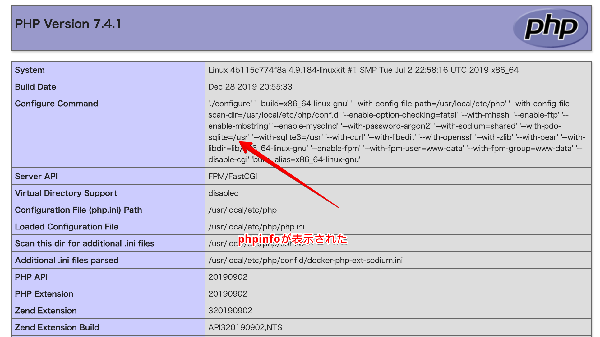

# ローカルPHP環境作成
以下の構成で環境を作る
nginx mysql5.7 php7.4

## 1. 事前にDOCKERとDOCKER-COMPOSEを使えるようにしておく
terminalでコマンドを打って確認する。


## 2. git cloneする


## 3. ファルダ構成
```bash
├── README.md
├── docker-compose.yml
├── mysql
│   └── data
├── nginx
│   └── nginx.conf
├── php
│   ├── Dockerfile
│   └── php.ini
└── www
    └── html
```
## 4. dockerフォルダでdocker-compose up -d ビルドと起動
`docker-compose up -d`

## 5. dokcer ps でコンテナが起動してるか確認

## 6. localhost:8080でアクセス


## 7. localhost:8888でphpmyadminにアクセスできる

passwordはデフォルトでroot

## 8. 終了するときはdocker-compose stop
`docker-compose stop`
一度ビルドした後の起動は
`docker-compose up`
